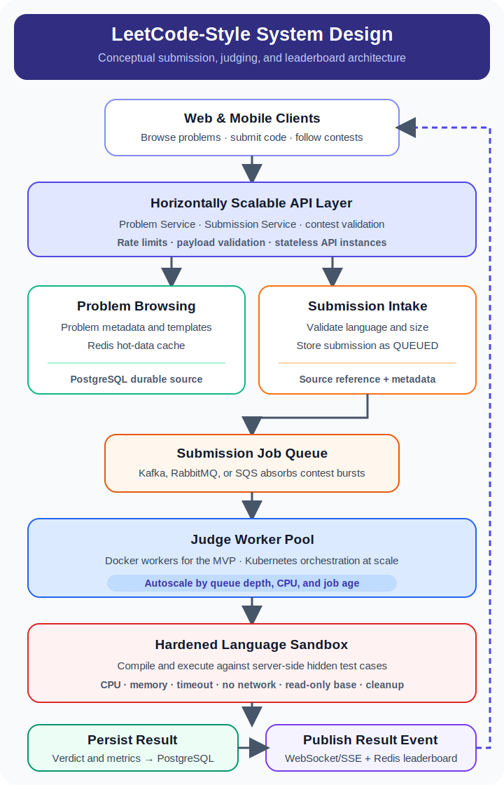

# LeetCode System Design Meetup Notes

Architecture-level notes for a simplified LeetCode-style platform discussed in a meetup setting.

> **Repository scope:** System-design documentation and interview preparation. This repository proposes an architecture; it is not a deployed coding platform or runnable implementation.

The design covers how users can:

- browse coding problems
- open a problem and write code in multiple languages
- submit code and get fast feedback
- view a live competition leaderboard

## Approach Summary

This repo explores two practical system design approaches:

- **Docker + PostgreSQL + queue** — a practical first version for running user submissions, storing problem data, and handling bursty traffic.
- **Kubernetes + worker pool + queue** — a scalable long-term option for large contest traffic, autoscaling, and operational reliability.

## Architecture Flow

  

## Repository Contents

- [`01_system_design_session.txt`](01_system_design_session.txt) — full architecture-level solution for the LeetCode-style system design problem.
- [`02_system_design_docker_sql_solution.txt`](02_system_design_docker_sql_solution.txt) — Docker-focused solution using PostgreSQL, including starter-code storage with `JSONB`.
- [`03_kubernetes_vs_docker_comparison_note.txt`](03_kubernetes_vs_docker_comparison_note.txt) — comparison between Kubernetes-based and Docker-based approaches.
- [`04_docker_approach_detailed_steps.txt`](04_docker_approach_detailed_steps.txt) — step-by-step Docker flow from submission to judging and result storage.

## Key Design Points

- Use a queue between the API layer and judge workers to absorb submission spikes.
- Run user code in isolated containers with strict CPU, memory, timeout, and network restrictions.
- Store problem metadata and submissions durably in `PostgreSQL`.
- Store starter code per language in `JSONB`.
- Keep hidden test cases on the server side only.
- Use `Redis` for a live leaderboard when contest traffic is high.

## Intended Use

This repository is for:

- meetup discussion
- interview preparation
- architecture review
- comparing practical MVP design against scalable production design

## License

This project is licensed under the terms of the [MIT License](LICENSE).
